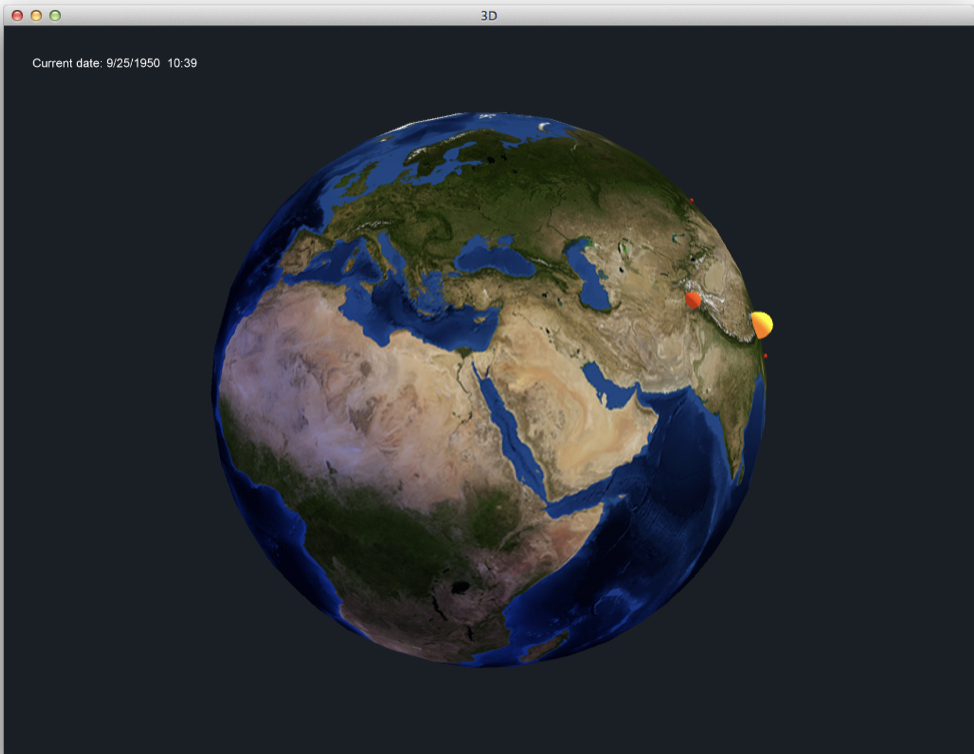
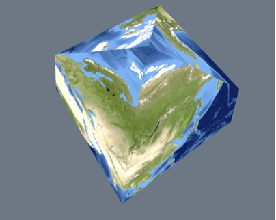

# COMP 465: Homework 3 - Earthquakes! 

## 1. Introduction
For this assignment, you’ll be working with data from NASA and the USGS to visualize on a globe where earthquakes happened between 1905 and 2007. Visualizations incorporating geospatial data are used and analyzed in many different contexts, including navigating a city (as seen in GPS devices), commercial development, and setting governmental policy.  This area also receives a significant amount of research attention.

Your assignment will look similar to the image below when you’ve finished it.

The earthquake dataset you’ll be using includes 13,540 different earthquakes.  The Earth texture dataset from NASA is available in resolutions down to 500m/pixel (although getting this to display on your graphics card is well beyond the scope of this assignment.)

### Learning goals

In completing this assignment, your goal should be to learn how to:
* Visualize real-world geographical data on a 3D textured globe --> provided
* Apply textures to 3D objects
* Algorithmically create a 3D mesh and display it using VBOs and VAOs
* Define normal vectors and texture coordinates for a sphere
* Manipulate 4x4 matrices to implement 3D rotations --> provided
* Convert from spherical coordinates (latitude and longitude) to 3D Cartesian coordinates

Note: Look through the code that has been provided to make sure you understand what it is doing and how it works 

## 2. Earth and Earthquake Data

I (from Bret) have included multiple scaled-down versions of this Earth texture with the code distributed on the website, since you need a fairly powerful computer to render even the lowest-quality image from the NASA page.  In order of decreasing quality, the following images are provided:
* earth.jpg: Full-resolution (8km/px, 5400x2700) image from NASA page
* earth-2k.jpg: 2048x1024 scaled-down version of image
* earth-1k.jpg: 1024x512 version of image
* earth-512.jpg: 512x256 version of image
* earth-256s.jpg: 256x256 version of image

Almost any graphics card should be able to use the 256s version of the Earth texture.  If your computer isn’t able to use this texture, you will need to use the computers available in the lab.  The Earth textures are stored in a simple equirectangular projection where the x value corresponds directly to the longitude and y directly to the latitude.

The earthquake dataset contains information about the earthquake’s magnitude (a measure of how severe the earthquake is) and its longitude and latitude.  You’ll be required to display this information on the globe in a meaningful manner.  More information on the earthquakes is available in the data file, and if you are interested, you can try to figure out ways to integrate additional data variables into your visualization.

## 3. Requirements and Grading Rubric
You will need to write the code that displays the three-dimensional Earth on screen with its texture (in Earth.cpp). You are provided with the code to display the earthquakes on the earth, as well as the code for rotating the Earth in response to user input from the mouse (both are in App.cpp).

There are 3 specific requirements for this assignment (originally 5 - I have left them here so you can match the requirements with the code):

1. *Convert spherical to Cartesian coordinates*: You will need to implement a function to convert latitude and longitude into a three-dimensional Cartesian coordinate.  Your spherical coordinates should have a radius of 1, and the north pole should map to (0, 1, 0).  When viewed from the north pole, longitude should increase in a counter-clockwise direction.  I have a starter function ready for you to fill in for this… look at `Earth::getPosition()`. If you would like to test your function, the first earthquake with latitude -18 and longitude -179 should return the position (-0.950912, -0.309017, 0.016598).
2. *Tessellate a sphere*: You will need to draw a sphere to the screen using the `Mesh` class.  Your tessellation should be able to use an arbitrary number of stacks and slices, as specified in the `STACKS` and `SLICES` constants in `Earth.cpp`.  You can assume that these will always be greater than 4.  You are required to send correct normals along with each vertex. (You may not use the Sphere class to do this!)
    
3. *Texture-map a sphere*: You will need to apply a texture to the sphere representing the Earth. It is acceptable for the texture to look slightly ‘cut off’ on only the top and bottom stack of the Earth’s mesh.  The image to the right shows what this ‘cutting off’ looks like with `STACKS` and `SLICES` set to a low value. Increasing the number of stacks and slices will make this problem harder to see.
4. (Provided) *Display earthquakes*: You need to display on the globe all of the earthquakes that have happened within the past one year (based upon the current visualization time). The earthquake positions and the sphere textures must match (i.e., an earthquake occurring in California must be displayed in the same location as the California of the Earth texture). Look at the demo video posted on moodle for an example. You should make sure that the [Ring of Fire](https://en.wikipedia.org/wiki/Ring_of_Fire) shows up clearly when you speed up the animation. You may use the BasicGraphics shapes to draw the earthquake markers or come up with your own custom geometry.  Earthquake sizes and colors should be based on the earthquake data in some meaningful way.  You must explain and justify the mapping you choose in your README.
5. (Provided) *Rotate world 4x4 matrix*: The mat4 `App::rotation` instance variable must be updated based upon mouse dragging.  When your program starts up, `App::rotation` will be the identity matrix, and the Earth’s north pole should be at the top of the window.  Rotation should be based on the mouse motion from frame to frame, such that dragging bottom-to-top rotates the Earth such that the upper portion is no longer visible and the lower portion is more visible.

Grading for this assignment will be based on the quality of your implementation for each of these 3 requirements. A base-level implementation would be an approximately spheroid object with a vaguely Earth-like texture on it.  The more spherical the shape and the more accurate the texture, the better the final grade.  

## 4. Getting Started with Support Code

The support code defines a program structure and everything you need to read and parse the earthquake data file. To make locating data files simpler, I have a header file called Config.h that contains absolute paths to your data files. You should edit this file with the full path (e.g., “C:\Users\bjackson\assignment3” or “/Users/bjackson/assignment3/”) where you’ve placed the data files. I will modify this file appropriately when grading your assignment.

## 6. Data Credits
The earthquake data comes from http://earthquake.usgs.gov/data/centennial/.
As per http://www.usgs.gov/laws/info_policies.html, this data is in the public domain.
Credit: U.S. Geological Survey
Department of the Interior/USGS

The Earth texture comes from http://visibleearth.nasa.gov/view_cat.php?categoryID=1484
As per http://www.jsc.nasa.gov/policies.html#Guidelines, this data is in the public domain.
Data produced by NASA’s Earth Observatory
